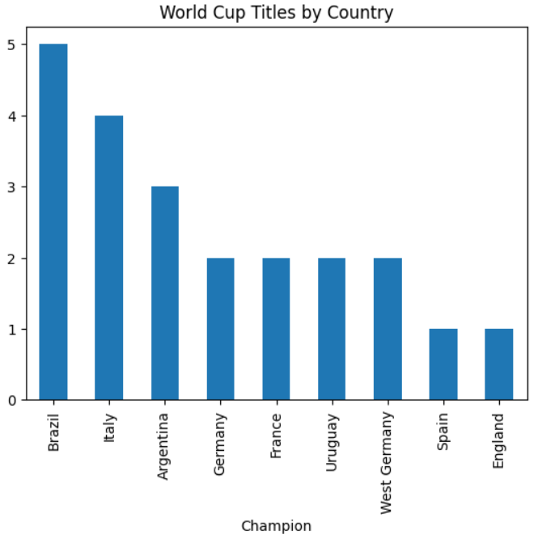
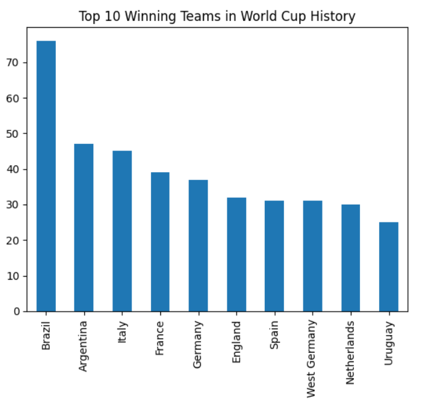
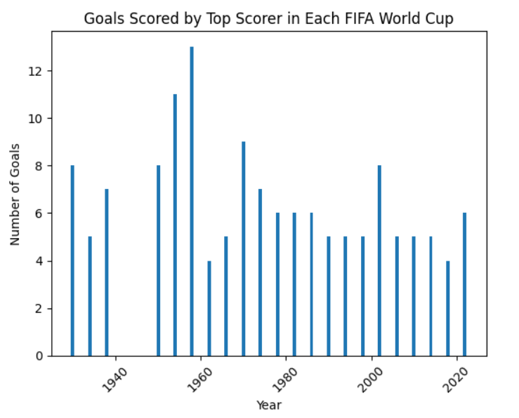
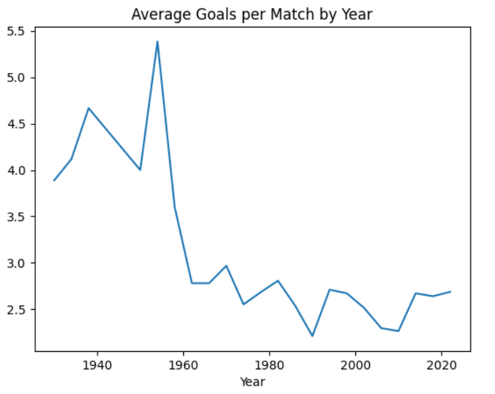
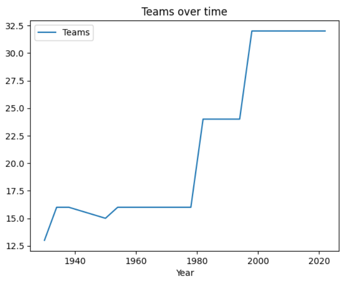
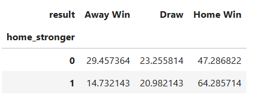

---
# FIFA World Cup Data Analysis (1930–2022)

## Overview

This project performs exploratory data analysis (EDA) on historical FIFA World Cup data from 1930 to 2022. By combining match-level, tournament-level, and FIFA ranking datasets, the project identifies long-term dominance patterns, scoring evolution, tournament expansion effects, and home advantage impact.

The analysis is implemented in Python using widely used data analysis and visualization libraries.

---

## Objectives

* Analyze historical FIFA World Cup match data
* Identify dominant teams and long-term performance trends
* Study goal-scoring evolution across tournaments
* Examine tournament expansion and competitiveness
* Analyze home advantage impact
* Explore the relationship between FIFA rankings and match outcomes

---

## Datasets Used

### matches_1930_2022.csv

Match-level data including:

* Home and away teams
* Match scores and penalties
* Expected goals (xG)
* Venue, attendance, officials
* Tournament rounds

### world_cup.csv

Tournament-level data including:

* Year and host country
* Winner, runners-up, and third place
* Number of teams and matches

### fifa_ranking_2022-10-06.csv

* Country rankings
* Ranking points
* Confederations

Used to analyze the influence of rankings on match outcomes.

---

## Tools and Technologies

* Python 3
* Pandas
* NumPy
* Matplotlib
* Seaborn
* Jupyter Notebook

---

## Project Structure

```
├── FIFAWC.ipynb
├── matches_1930_2022.csv
├── world_cup.csv
├── fifa_ranking_2022-10-06.csv
├── visuals/
│   ├── wc_winners.png
│   ├── top_10.png
│   ├── goals_topscorers.png
│   ├── avg_goals_per_match.png
│   ├── teams_over_time.png
│   └── home_advantage.png
└── README.md
```

---

## How to Run the Project

1. Clone the repository:

```
git clone https://github.com/your-username/fifa-world-cup-analysis.git
```

2. Install required libraries:

```
pip install numpy pandas matplotlib seaborn
```

3. Launch the notebook:

```
jupyter notebook FIFAWC.ipynb
```

---

## Methodology

### Data Preparation

* Standardized team names across different eras
* Removed duplicate match entries
* Converted date columns to datetime format
* Ensured numerical consistency for goals and match statistics
* Aggregated tournament-level metrics

No artificial imputation was performed for missing values in order to preserve historical integrity.

---

# Analysis and Results

## 1. Historical Dominance

### Which countries have dominated FIFA World Cup history?

<p align="center">
  
</p>

**Observations**

* A small group of nations holds the majority of titles.
* Brazil leads historically.
* Germany and Italy follow closely.
* Argentina and France dominate recent tournaments.

**Interpretation**

World Cup success is highly concentrated among elite football nations. Sustained dominance reflects structural strength in domestic leagues, youth development systems, and tactical evolution across generations.

---

### Which teams have won the most matches in World Cup history?

<p align="center">
  
</p>

**Observations**

* A small group of nations leads in total match victories.
* These teams consistently reach later tournament stages.
* Match wins do not perfectly align with total titles.

**Interpretation**

Total match wins reflect long-term consistency and deep tournament runs. Unlike titles, which depend on single-tournament success, match wins measure sustained competitiveness across decades.

---

## 2. Individual Goal-Scoring Trends

### Has the role of the single dominant goal-scorer diminished over time?

<p align="center">
  
</p>

**Observations**

* Early tournaments show extreme goal-scoring peaks (11–13 goals).
* After the 1970s, top scorers typically range between 5–8 goals.
* Modern tournaments show reduced variance in top scorer totals.

**Interpretation**

The compression of goal tallies suggests improved defensive organization, tactical standardization, increased athletic conditioning, and greater attacking distribution across squads.

---

## 3. Evolution of Scoring Rates

### Has football become more defensive over time?

<p align="center">
  
</p>

**Observations**

* Early World Cups had high average goals per match.
* Mid-era tournaments show a decline in scoring.
* Modern tournaments display stabilization.

**Interpretation**

Scoring trends reflect tactical evolution: early open attacking systems, mid-20th century defensive structuring, and modern balanced pressing and structured systems.

---

## 4. Tournament Expansion and Competitiveness

### Has expanding the number of teams increased competitiveness?

<p align="center">
  
</p>

**Observations**

* Tournament participation expanded significantly over time.
* Global representation increased substantially.

**Interpretation**

Expansion improved inclusivity and competitive diversity. However, historical dominance remains concentrated, suggesting institutional strength outweighs tournament size.

---

## 5. Home Advantage Analysis

### Does home advantage significantly improve performance?

<p align="center">
  
</p>

**Observations**

* Many host nations progress beyond the group stage.
* Only a limited number of hosts win the tournament.
* Some hosts underperform despite home conditions.

**Interpretation**

Home advantage provides crowd support, climate familiarity, and reduced travel fatigue. However, squad quality remains the primary determinant of tournament success.

---

## Key Findings

* World Cup success is concentrated among a small elite group of nations.
* Tactical evolution has significantly influenced scoring patterns.
* Individual goal dominance has declined in modern tournaments.
* Tournament expansion increased diversity but not title parity.
* Home advantage provides measurable benefits but does not guarantee victory.

---

## Limitations

* Older tournaments lack advanced performance metrics.
* Contextual factors such as injuries and referee decisions were not modeled.
* Observed relationships represent correlations rather than causal conclusions.

---

## Future Work

* Incorporate advanced metrics such as xG and possession trends.
* Build predictive models using Logistic Regression and Random Forest.
* Develop interactive dashboards using Power BI or Tableau.
* Compare World Cup trends with continental tournaments.

---

## Conclusion

Although football remains unpredictable at the match level, long-term tournament outcomes reveal measurable structural patterns driven by tactical evolution, institutional strength, and historical dominance.

This project demonstrates how statistical analysis can uncover meaningful insights within one of the world’s most competitive sporting events.

---

## Author

Samyak Gaikwad
Data Analysis | Machine Learning | Artificial Intelligence
